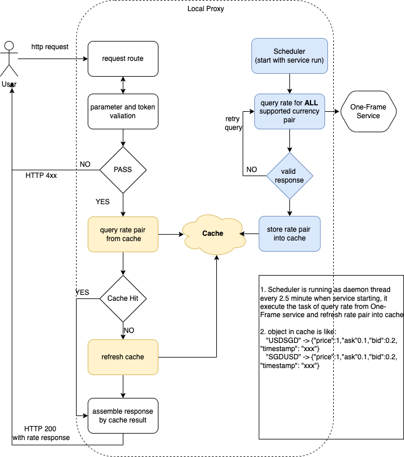
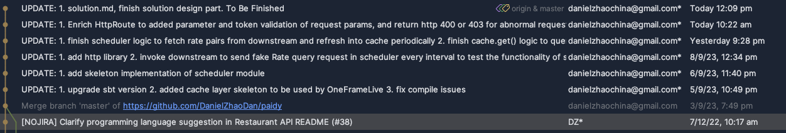

# A local proxy for Forex rates Solution Design 

# Functional Requirement Analysis
Given below functional requirements:
* The service returns an exchange rate when provided with 2 supported currencies
* The rate should not be older than **5 minutes**
* The service should support at least **10,000** successful requests per day with 1 API token

And the following drawback of the [One-Frame service](https://hub.docker.com/r/paidyinc/one-frame):
* The One-Frame service supports a maximum of **1000** requests per day for any given authentication token.

It is obvious that it is impossible to make it by simply redirect every request of proxy to One-Frame service directly. 
However, we are allowed to use same response within 5 minutes. So the first thing comes to my mind is **cache**, we can cache the response of 
same currency pair in proxy and return directly without invoking One-Frame service as long as it is within 5 minutes.

In the following document, I will explain the cache solution as final design of this proxy 
# Solution Architecture
## Solution with Cache

* When proxy starts, there will be a scheduler start to execute every 2.5 minutes (configurable) to query rate for all currencies 
(as One-Frame service can accept multiple currency pair in one request, by this we way can reduce the count of request sent) supported by proxy from One-Frame Service
* * If got valid response, refresh latest rate pair into cache
* * if failed to get response, redo the execution
* When requests from user comes, after basic authentication and parameter validation, we will directly return the rate pair in cache as http response.
* * By right, the cache result should always be not null, but in case failed to get result from cache, we redo the cache refresh task (same with Scheduler does) then return response
* The Cache implemented in this solution is Memcached, but we can use other alternative solution like Redis in production.
### Pros 
1) We send request to One-Frame service every 2.5 minute, then there will be only 24 * (60 minute / 2.5 minutes) = **576** requests will be sent to One-Frame service
2) The cache expire time is 3 minutes (configurable, but should be between [2.5, 5], so we can guarantee the rate pair is no older than 5 minutes
3) As we use cache to serve request, there is **no limit** on total count of requests of each token per day, and we are able to support much higher volume of concurrent requests with very slow latency
### Cons
1) Although in this project, we can get rate of all currency pairs in one request, 
but in real worlds and especially crypto business, it is hard as there will be hundreds of official fiat currency and even thousands of crypto currency,
it is hard to fetch rates of all pairs in one request and also need larger Cache memory size.
2) We need a solid disaster recovery solution for Cache crash case, or it will result in either bad experience to users or spike of request to downstream One-Frame Service 

The solution to the Cons is out of Scope of this solution, I will share my potential solution in appendix.
### Non-Functional Analysis
1. **[Scalability]** As we serve user's request by cache, so it is easier to scale out our service throughput by increasing memory size or using more powerful Cache solution like Redis
2. **[Reliability]** The maintenance of rate and requests from users are decoupled, which means downstream rate service would not impact the stability of proxy; 
and it is very easy to add-on other external rate providers and switch-off the dependency on unavailable providers 


# How to run locally
Please refer to forex-mtl/docs/demo.mov for demo

## Prerequisite
* install `Memcached` and start in 11211 port (can refer to this [doc](https://gist.github.com/tomysmile/ba6c0ba4488ea51e6423d492985a7953))
* download docker and start docker desktop from official website
* Pull the docker image with `docker pull paidyinc/one-frame` and Run the service locally on port 8080 with `docker run -p 8080:8080 paidyinc/one-frame`
* install `JDK 11`, `scala 2.13.5` and `sbt` if needed

## Start service locally
1) open terminal and change to project folder `cd ......./projects/paidy/forex-mtl/`
2) build project with command `sbt`. If build successfully, you should be able to see
    ```
   [info] welcome to sbt 1.9.4 (Homebrew Java 20.0.1)
    [info] loading settings for project forex-mtl-build from plugins.sbt ...
    [info] loading project definition from /Documents/projects/paidy/forex-mtl/project
    [info] loading settings for project forex-mtl from build.sbt ...
    [info] set current project to forex (in build file:/Documents/projects/paidy/forex-mtl/)
    [info] sbt server started at local:///.sbt/1.0/server/af42d737d9f59f63ba20/sock
    [info] started sbt server
    sbt:forex>
   ```
3) compile the project with command `compile`. If compile successfully, you should be able to see 
   ```
   [success] Total time: 1 s, completed 10 Sept 2023, 4:42:23 pm
   ```
4) start the server with command `run`, you should be able to see
   ```
   2023-09-10 16:45:06.105 INFO net.spy.memcached.MemcachedConnection:  Setting retryQueueSize to -1
   2023-09-10 16:45:06.110 INFO net.spy.memcached.MemcachedConnection:  Added {QA sa=/0.0.0.0:11211, #Rops=0, #Wops=0, #iq=0, topRop=null, topWop=null, toWrite=0, interested=0} to connect queue
   refreshing for No. 0...
   16:45:06.404 [ioapp-compute-0] INFO  o.h.b.c.nio1.NIO1SocketServerGroup - Service bound to address /[0:0:0:0:0:0:0:0]:18080
   16:45:06.406 [ioapp-compute-0] INFO  o.h.server.blaze.BlazeServerBuilder -
     _   _   _        _ _
   | |_| |_| |_ _ __| | | ___
   | ' \  _|  _| '_ \_  _(_-<
   |_||_\__|\__| .__/ |_|/__/
   |_|
   16:45:06.430 [ioapp-compute-0] INFO  o.h.server.blaze.BlazeServerBuilder - http4s v0.21.22 on blaze v0.14.15 started at http://[::]:18080/
   ```
   The server is started in 18080 port.

Now it is time to try the proxy!

## Access proxy
### Case 1: Happy case requests
   `curl  -i 'localhost:18080/rates?from=USD&to=aud&token=10dc303535874aeccc86a8251e6992f5'`
   
response:
   ```
   HTTP/1.1 200 OK
   Content-Type: application/json
   Date: Sun, 10 Sep 2023 08:47:19 GMT
   Content-Length: 143
   
   {"from":"USD","to":"AUD","bid":0.05887504426624901,"ask":0.2735646425035929,"price":0.16621984338492096,"timestamp":"2023-09-10T08:45:06.746Z"}
   ```
### Case 2: 403 case with wrong or no token
`curl  -i 'localhost:18080/rates?from=USD&to=aud&token=abc'`

Response:
```HTTP/1.1 403 Forbidden
Content-Type: text/plain; charset=UTF-8
Date: Sun, 10 Sep 2023 08:49:06 GMT
Content-Length: 64

Your request is forbidden because of Missing or wrong token used
```
### case 3: 400 case with wrong currency parameter
`curl  -i 'localhost:18080/rates?from=USD&token=10dc303535874aeccc86a8251e6992f5&to=JP'`

Response:
```
HTTP/1.1 400 Bad Request
Content-Type: text/plain; charset=UTF-8
Date: Sun, 10 Sep 2023 08:52:09 GMT
Content-Length: 25

invalid currency argument
```
### case 4: 404 case if no enough parameters provided
`curl  -i 'localhost:18080/rates?from=USD&token=10dc303535874aeccc86a8251e6992f5'`

`curl  -i 'localhost:18080/rates?from=USD&to=JPY'`

Response:
```
HTTP/1.1 404 Not Found
Content-Type: text/plain; charset=UTF-8
Date: Sun, 10 Sep 2023 08:50:40 GMT
Content-Length: 9

Not found
```

# Code Walking through
## Commit History
There are totally 6 commits about code changes and 2 commits about document, please refer to this PR [link](https://github.com/paidy/interview/compare/master...DanielZhaoDan:paidy:master) for more details:

## Code structure
```
  - forex-mtl
      - docs ----> contains the documents used in .md file
      - project
        - build.properties ----> defined sbt version
        - Dependencies ----> added some required libraries like akka-http
      - src
        - main
          - resources
            - application.conf ----> added configuration for external, cache, scheduler
          - scala
            - forex
              - cache ----> cache related implementation 
              - http
                - rates
                  - RatesHttpRoutes.scala ----> added parameter and token validation logic
              - scheduler -> package contains all scheduler tasks 
              - services
                - rates
                  - interpreters
                    - OneFrameLive.scala ----> the implementation to serve user requests
```
### Something To be Optimised...
Because I did not have professional experiences using Scala, although I have spent some time to learn the concept, syntax, use cases of scala, 
I have to say the current implementation is still not perfect. From my point of view, below code level optimisation should be applied:
1) Use `AuthMiddleware` for Authorisation and return HTTP 401 in middleware level not HTTP 403 in HttpRoutes
   * I have spent some time to explore and try it according to this [doc](https://blog.rockthejvm.com/scala-http4s-authentication/), but failed to merge it to existing `routesMiddleware` and `appMiddleware`.
2) involve log libraries to print logs of critical methods instead of using `print` to print in console
3) make use of Either [A, B] syntax to handle ERROR or exception case gracefully instead of using dummy return value to upstream (like the get function in Localcache.scala)


# Appendix
## Potential Solution to Cons of Cache Solution
### Supports to plenty of currencies and even crypto and earn profit
Firstly, let us think about the classic **shortest-path** problem, there are multiple roads from A to B, we try to figure out shortest one by comparing
> A -> C -> D -> B or A -> E -> F -> B

which means, there is no need to be a direct way between A and B.

Let us go back to this currency pair case, similarly, if we need the best (or just a valid) pair between USD and JPY,
there is **no need to be** a direct pairs for USD->JPY, as long as there are:
> USD -> SGD, SGD -> AUD, AUD -> JPY

or 
> USD -> BNB, BNB -> BTC, BTC -> ETH, ETH -> USDT, USDT -> JPY

in cache result. Then by applying some calculation of the bid, ask and price of each pair, 
we can finally get a rate pair with best price, and make **profits** from it. 


